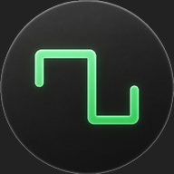
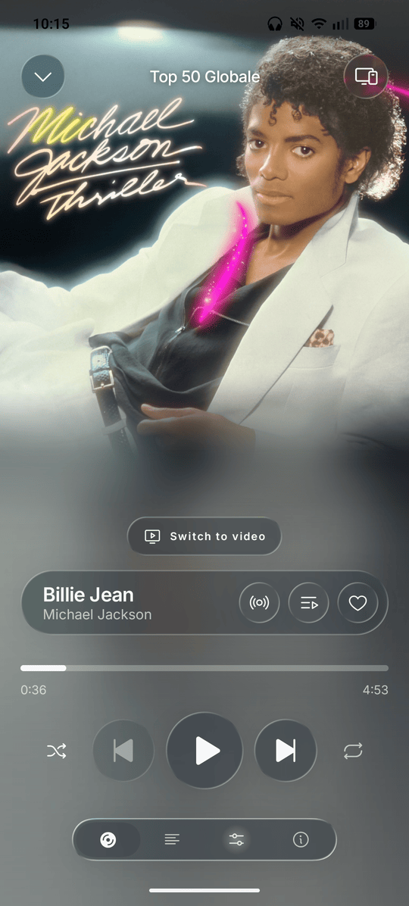
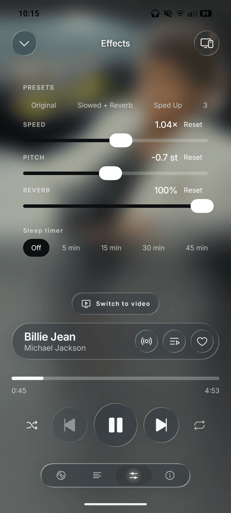
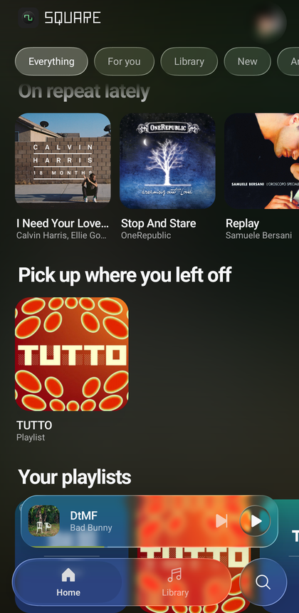

<p align="center">
  
</p>

<h1 align="center">Square</h1>

<p align="center">
  An unofficial Android client for Spotify Premium, built in Liquid Glass.
</p>

Built on [librespot](https://github.com/librespot-org/librespot). The official
app is not needed and is not used: audio is streamed in-process by a native Rust
core.

| Player | Effects | Home |
| --- | --- | --- |
|  |  |  |

## Why use this instead of the official app

**It is built in Liquid Glass.** Every control — the tab bar, the player, the
sheets, the menus — is drawn on one refracting material that bends the artwork
and the canvas video behind it. Nothing on Spotify for Android looks like this,
and it is the reason the app exists.

**It can bend the music.** Speed and pitch move independently, there is a real
reverb on the output, and the three save as presets — so "slowed + reverb" is a
single tap on any track in the catalogue rather than a file someone else made.

**It is fast.** A skip is sound in about a third of a second, because the engine
fetches the next track while the current one plays and the app never waits on it
to move. The playing list is cached rather than rebuilt, so scrolling stays at
the screen's own frame rate.

> **Read this before you install it.** Square re-implements Spotify's protocol,
> which their Terms of Service forbid. It cannot go on the Play Store, it needs
> a Premium account, and using it is at your own risk. There is no warranty of
> any kind — see the licence.

## What it does

- **Plays your library.** Playlists, albums, artists, liked songs, search, all
  through Spotify's own access point rather than the public Web API.
- **Is a Connect device.** Square appears in the device list of every other
  Spotify client, and playback can be handed to and taken from it.
- **Records what you listen to.** Listens are reported to the account, filed
  under the playlist or album they happened in, so Square can be used *instead*
  of the official client rather than beside it.
- **Lyrics, canvas, artwork.** Synced lyrics where Spotify has them, the looping
  canvas video on the player, and the covers of the generated playlists in the
  app's own language.
- **Audio effects.** Speed and pitch independently, plus reverb, with presets —
  the "slowed + reverb" edit, done properly, on any track.
- **Six languages.** English, Italian, Spanish, French, German, Portuguese, and
  a picker that does not depend on the phone's own language.

## Architecture

```
┌─────────────────────────────────────────┐
│ Compose UI                              │
├─────────────────────────────────────────┤
│ MediaController ──► MediaSession        │  notification, lock screen, Bluetooth
├─────────────────────────────────────────┤
│ PlaybackService                         │  foreground service, owns the engine
│   └─ LibrespotPlayer : SimpleBasePlayer │  adapts the engine to Media3
├──────────────────┬──────────────────────┤
│ Web API (HTTPS)  │ JNI ──► libsquarecore│
│ search, top      │        librespot     │
│ tracks, devices  │        + AudioTrack  │
└──────────────────┴──────────────────────┘
```

The catalogue comes from the access point (`native/src/catalog.rs`), not from
`api.spotify.com`: the Web API meters requests per application, and there is no
streaming endpoint there at all. The Web API is used only where the access point
has nothing to offer — search, the account's top tracks, the Connect device
list, editing playlists — and that is why Square asks you to register an
application of your own.

The player keeps no copy of the engine's state: `LibrespotPlayer` reports only
what the engine has confirmed by event. That is why the seek bar never runs
ahead of the audio.

## Building

Requirements:

- Android Studio with SDK platform 35 and **NDK 28.2.13676358**
- Rust ≥ 1.86 with the Android targets
- `cargo-ndk`

```bash
rustup target add aarch64-linux-android armv7-linux-androideabi x86_64-linux-android
cargo install cargo-ndk
sdkmanager --install "ndk;28.2.13676358"
```

Then:

```bash
./gradlew :app:assembleDebug
```

The `cargoBuild` task cross-compiles the core and copies the `.so` files into
`app/src/main/jniLibs`. To iterate faster, cut `nativeAbis` in
`app/build.gradle.kts` down to `arm64-v8a`.

### Signing a release build

The release build is signed with a real key when `keystore.properties` exists
beside the project, and with the debug key otherwise. The file and the keystore
are both ignored by git and must stay that way.

```bash
keytool -genkey -v -keystore square-release.jks -keyalg RSA \
        -keysize 2048 -validity 10000 -alias square
```

```properties
# keystore.properties — never commit this
storeFile=square-release.jks
storePassword=…
keyAlias=square
keyPassword=…
```

## Notes for anyone reading the code

**`librespot-core` is patched.** A local copy under `native/vendor/`, wired in
with `[patch.crates-io]`. Three changes: the advertised OS is pinned to
`"linux"` so it agrees with the desktop client id, Mercury gained POST and
header fields so listening events can be posted, and the session carries a
language so artwork comes back in it. All three are explained in
[native/vendor/README.md](native/vendor/README.md).

**OAuth uses the keymaster client id on a fixed port.** The redirect has to be
exactly `http://127.0.0.1:5588/login`, the only one registered for that id, and
the socket must be bound to the IPv4 loopback explicitly — on Android
`InetAddress.getLoopbackAddress()` answers `::1` and the browser then fails the
redirect with `ERR_CONNECTION_REFUSED`.

**`MediaSession.Callback` is not optional.** A session never hands a
controller's `MediaItem`s to the player directly; it asks the app to resolve
them first, and the default implementation rejects every item without a
playable URI. Ours carry only a `mediaId`, so without `onAddMediaItems` the call
vanishes silently.

**Do not rebuild the playlist in `getState()`.** It runs on every
`invalidateState`, which includes each position update: rebuilding dozens of
`MediaItemData` twice a second makes enough garbage to be heard as stuttering.
The list is cached and dropped only when the queue actually changes.

**`vergen` is pinned to 9.0.6.** `librespot-core` 0.8.0's build script does not
compile against 9.1.0 — a semver-compatible bump that changed the `Add` trait.
The pin lives in `native/Cargo.lock`.

**Token refresh is serialised.** `TokenStore.validAccessToken()` takes a mutex
before refreshing. Spotify rotates refresh tokens, so without it two parallel
requests around expiry would each refresh and the loser would save a token that
is already dead. It is the bug behind the random logouts in most other clients.

## Third-party code

| Project | Licence | How it is used |
| --- | --- | --- |
| [librespot](https://github.com/librespot-org/librespot) | MIT | The engine. `librespot-core` is vendored with local patches. |
| [Bungee](https://github.com/kupix/bungee) | MPL-2.0 | Time stretching, fetched at build time. |
| [AndroidLiquidGlass](https://github.com/Kyant0/AndroidLiquidGlass) | Apache-2.0 | The glass material; the catalog components are copied with their notice. |
| [Phosphor Icons](https://phosphoricons.com) | MIT | Every icon in the app. |
| librespot-java | Apache-2.0 | The listening-event format, re-implemented from its `EventService` rather than copied. |

## Licence

GPL-3.0-or-later. See [LICENSE](LICENSE).
