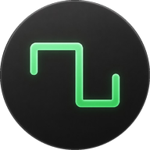
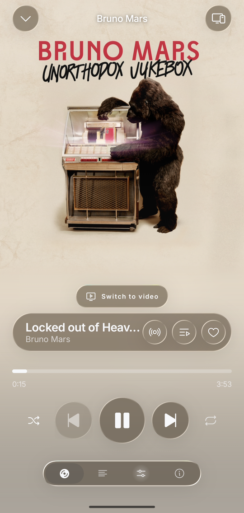
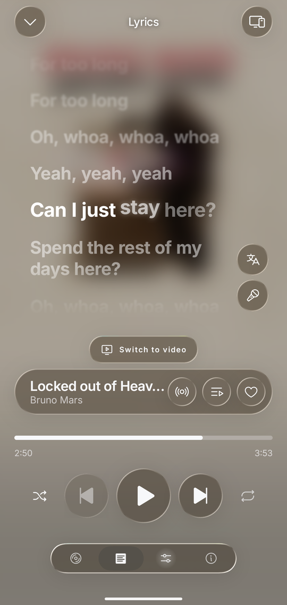
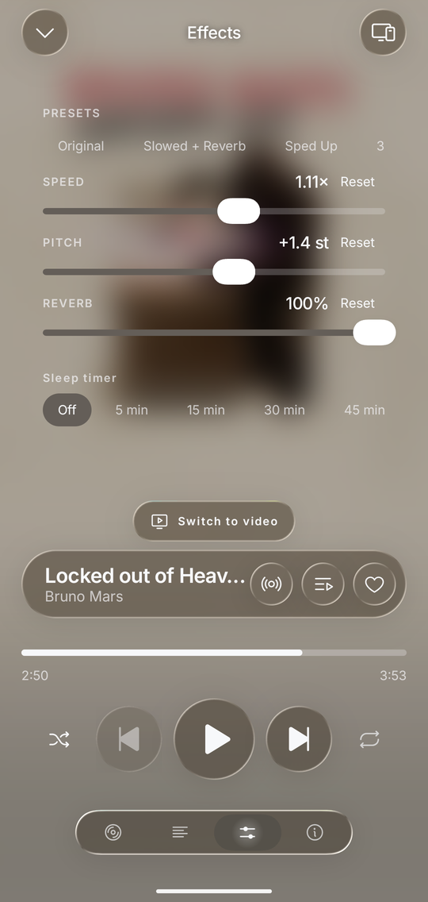
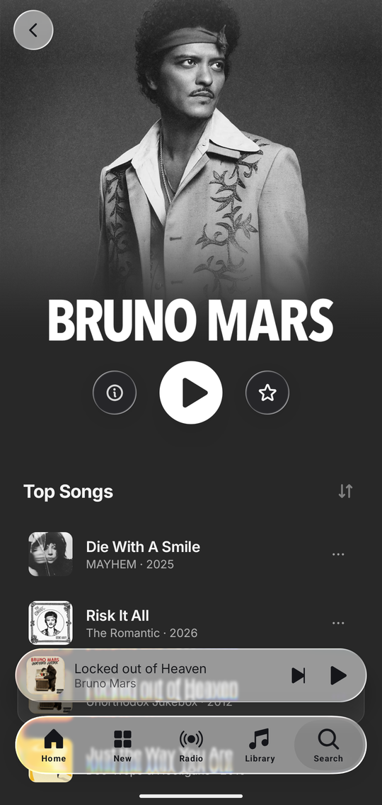
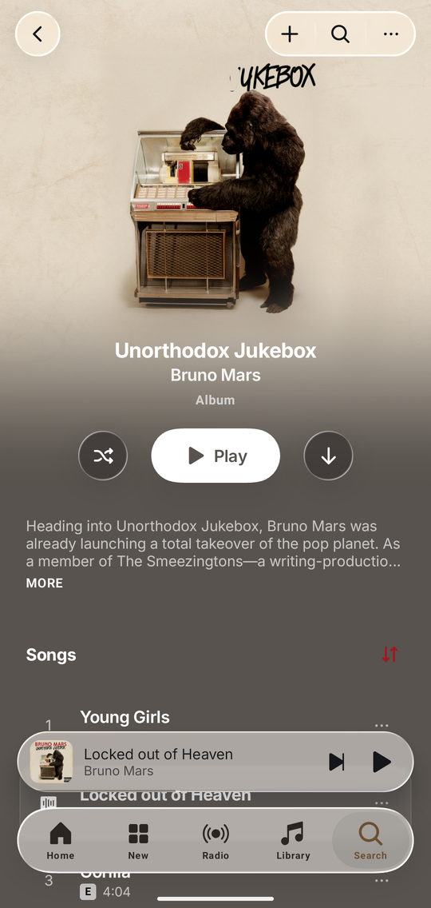
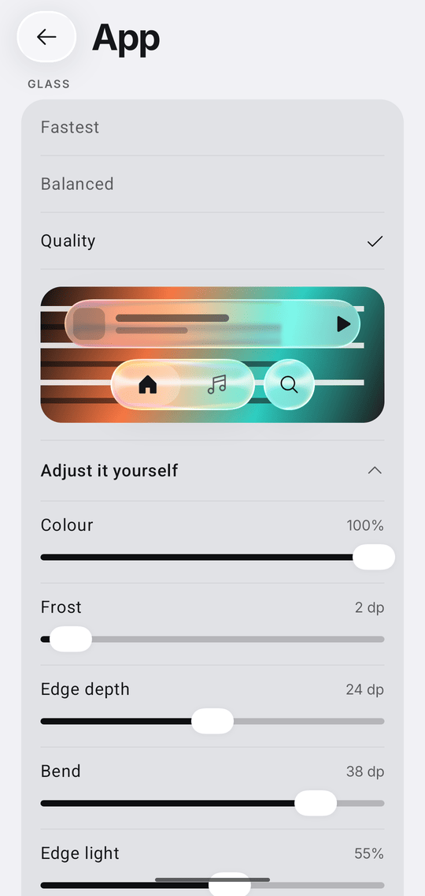

<p align="center">
  
</p>

<h1 align="center">Square</h1>

<p align="center">
  An unofficial Android music client for Spotify Premium and YouTube Music,
  built in Liquid Glass.
</p>

<p align="center">
  <a href="https://github.com/Lelonio/Square/releases/latest"></a>
  <a href="https://github.com/Lelonio/Square/releases"></a>
  
  <a href="LICENSE"></a>
</p>

<p align="center">
  <a href="#download"><b>Download</b></a> ·
  <a href="#features"><b>Features</b></a> ·
  <a href="#first-launch"><b>First launch</b></a> ·
  <a href="#faq"><b>FAQ</b></a> ·
  <a href="docs/DEVELOPMENT.md"><b>Building</b></a>
</p>

| Player | Lyrics | Effects |
| :---: | :---: | :---: |
|  |  |  |
| **Artist** | **Album** | **Glass settings** |
|  |  |  |

## Features

### Two sources, one app

- **Spotify or YouTube Music**, chosen at first launch and switchable in the
  settings. Home, search, the library and the player work the same on both.
- **Spotify**: your own account, with its playlists, library and Connect
  devices. Needs Premium.
- **YouTube Music**: the whole catalogue and the music videos, with no account
  needed. Sign in with Google to bring in your playlists, albums and followed
  artists.

### Player

- The cover or the song's looping canvas video behind the controls.
- Music videos: switch from the song to its video in place, without losing the
  queue or the position, and keep watching in picture-in-picture.
- Radio from any song, and autoplay of similar songs when the queue ends.
- Crossfade between songs, with an option to skip trailing silence.
- Sleep timer: after 5 to 60 minutes or at the end of the song, fading out
  before it stops.

### Audio effects

- Speed and pitch, each on its own, plus reverb.
- Presets, so "slowed + reverb" is one tap on any song.
- Karaoke: turn the voice down.
- Streaming quality that follows the connection, or a fixed one.

### Lyrics

- Synced lyrics, word by word where they exist and line by line otherwise.
- Translation into your language, under the original lines.

### Library and discovery

- Playlists, albums, artists and liked songs. Create, rename and delete
  playlists, add and remove songs, pin favourites, follow artists.
- A home page of shelves made for you, a **New** tab with releases and charts,
  and a **Radio** tab of stations, moods and genres.
- Search, with your recent searches kept (swipe one away to remove it).
- The music already on your phone, in a Local files shelf.

### Offline

- Download playlists, albums and songs, from either source. A song kept by two
  playlists is downloaded once.
- Downloads over Wi-Fi only, and automatic downloads of your liked songs.
- Offline mode: play only what is on the phone.

### Spotify extras

- A **Connect** device: send playback to Square from any other device, and
  control your other devices from it.
- What your friends are listening to.
- Similar playlists at the end of each playlist.
- Song credits: performers, writers and producers.
- What you play is saved to your listening history, as it would be anywhere
  else you listen.
- Spotify links can open straight in Square.

### Android Auto

- Browse playlists and recently played, search by voice, like a song or start a
  radio from the car.

### Look and language

- Every control, the tab bar, the player, the sheets and the menus are made of
  one refracting glass. Blur, refraction and tint are adjustable, with a lighter
  mode for slower phones.
- Eight languages: English, Italian, Spanish, French, German, Portuguese, Hindi
  and Turkish, chosen independently of the phone's own.

## Download

Download the APK from the [latest release](https://github.com/Lelonio/Square/releases/latest)
and install it. Square needs Android 8.0 or later.

Square updates itself: it checks for new releases and installs them from the
settings. It is not on the Play Store and cannot be; see the
[disclaimer](#disclaimer).

<details>
<summary><b>The first minutes after installing are slower</b></summary>

Android takes a while to optimise a freshly installed app, and until it does
the interface is noticeably slower. To do it straight away, open the app once
and give it a few seconds, then run this with the phone connected:

```bash
adb shell cmd package compile -m speed-profile -f dev.lelonio.square
```

Run before the app has been opened, the command finds nothing to compile.

</details>

## First launch

Square first asks where the music should come from. You can change it later in
the settings.

- **YouTube Music** plays straight away. Signing in with Google, from the
  settings, is optional.
- **Spotify** needs a Premium account and a few minutes of guided setup: you
  sign in, then register a free app of your own in Spotify's developer
  dashboard and paste its client ID. Search and a few other features go
  through Spotify's Web API, which limits requests per app, so with your own
  app the limit is yours alone. The setup walks you through every step.

## FAQ

**Square does not appear in Android Auto.**
Android Auto only lists apps installed from the Play Store. Turn on "Unknown
sources" in Android Auto's developer settings and Square shows up.

**Can I use a free Spotify account?**
No. A free account can sign in, but Spotify only streams to a client like this
one with Premium. YouTube Music works with no account at all.

**YouTube Music search works, but songs do not play.**
YouTube changes how its streams are served every so often. Update to the
latest release, which is usually where the fix is.

## Disclaimer

Square is not affiliated with, endorsed by or connected to Spotify or Google.
Both sources are used on terms they do not offer: Square re-implements
Spotify's protocol, which Spotify's Terms of Service forbid, and reads YouTube
Music through the private endpoints its own web client uses. It cannot be
published on the Play Store, and you use it at your own risk. There is no
warranty of any kind; see the licence.

## Support

Square is free and has no ads. If it is useful to you, you can support its
development on [Ko-fi](https://ko-fi.com/lelonio).

## Credits

| Project | Licence | How it is used |
| --- | --- | --- |
| [librespot](https://github.com/librespot-org/librespot) | MIT | The Spotify engine. `librespot-core` is vendored with local patches. |
| [Metrolist](https://github.com/mostafaalagamy/Metrolist) | GPL-3.0 | Its InnerTube client, vendored as [`innertube/`](innertube/), because it is published nowhere else. Powers the signed-in YouTube Music library. |
| [NewPipeExtractor](https://github.com/TeamNewPipe/NewPipeExtractor) | GPL-3.0 | Anonymous YouTube Music search and stream URLs. |
| [lossless.wtf](https://lossless.wtf) | n/a | Synced lyrics timed to the word, asked first on both sources. |
| [LrcLib](https://lrclib.net) | n/a | Synced lyrics for the YouTube Music source, over its open API. |
| [Bungee](https://github.com/kupix/bungee) | MPL-2.0 | Time stretching, fetched at build time. |
| [AndroidLiquidGlass](https://github.com/Kyant0/AndroidLiquidGlass) | Apache-2.0 | The glass material; the catalog components are copied with their notice. |
| [Phosphor Icons](https://phosphoricons.com) | MIT | Every icon in the app. |
| librespot-java | Apache-2.0 | The listening-event format, re-implemented from its `EventService` rather than copied. |

## Building from source

Requirements, build steps, signing, the architecture and notes on the code are
in [docs/DEVELOPMENT.md](docs/DEVELOPMENT.md).

## Licence

GPL-3.0-or-later. See [LICENSE](LICENSE).
