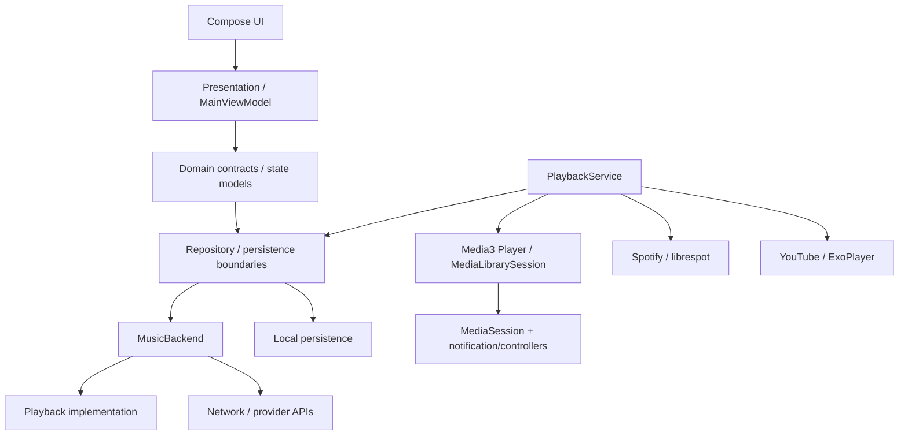

# SPOTLIGHT — Phase 1 Architecture & State Management

## Status

Phase 1 is an incremental architecture pass. Existing Media3/librespot/YouTube playback paths remain in place. No Phase 2 playback-engine behavior (preloading, crossfade, advanced retry/recovery, or transition optimization) is introduced here.

## Dependency direction



The live playback engine is intentionally service-owned. `PlaybackService` constructs and owns the active `Player`, the Spotify `LibrespotPlayer`, the queue, and the `MediaLibrarySession`. The UI receives a `Player` projection and derives presentation state from player events rather than mutating playback state itself.

## Current ownership

| Concern | Owner | Notes |
| --- | --- | --- |
| Active Media3 player | `PlaybackService` | Single service lifecycle owner. |
| Spotify native engine | `PlaybackService` / `LibrespotPlayer` | Existing librespot path preserved. |
| Queue mutation | `PlaybackService` / `PlayQueue` | `PlayQueue` is explicitly looper-confined. |
| Persisted playback snapshot | `PlaybackStore` | Persistence only; does not control a player. |
| Playback presentation projection | `PlayerState.kt` | Compose-facing derived state; not authoritative. |
| Catalog/library UI state | `MainViewModel` | ViewModel-owned, non-playback presentation state. |
| Provider abstraction | `MusicBackend` | Spotify and YouTube implementations remain separate. |

## Authoritative playback state

The existing authoritative runtime state is the Media3 `Player` instance owned by `PlaybackService`. This is important because the same player is already consumed by the MediaSession/notification/controller pipeline. Creating another mutable singleton or another player-owned queue would create drift.

`ui/player/PlayerState.kt` therefore remains a projection layer. Its `PlaybackState` is immutable and is reconstructed from the current player's metadata, playback state, timeline, repeat/shuffle settings, and playback parameters. Position is deliberately sampled separately so the entire Compose tree does not recompose at playback-update frequency.

For architecture/test seams, `playback/PlaybackStateModel.kt` defines a small immutable application vocabulary (`PlaybackStatus`, `PlaybackStateSnapshot`, `PlaybackError`) and `PlaybackStateReducer.kt` defines deterministic state transitions. These classes are deliberately side-effect-free and do not own a player. They must not be promoted to a second runtime authority; the service/player remains authoritative.

## State vs event semantics

- **State** belongs in immutable snapshots / `StateFlow`-style streams and can be replayed safely to a newly recreated collector.
- **Events** such as navigation requests or one-shot UI effects should remain event streams and should not be reconstructed as durable state.
- Existing Compose collection uses `collectAsStateWithLifecycle()` where the UI consumes reactive application streams.
- Player event listeners are removed in `DisposableEffect` when a Compose projection leaves the composition.
- Position is intentionally not stored in the slow-changing Compose snapshot because it changes frequently.

## Coroutine ownership

- `MainViewModel` uses `viewModelScope` for UI-lifetime work.
- `PlaybackService` owns an explicit `SupervisorJob + Dispatchers.Main.immediate` service scope and cancels it during service destruction.
- IO work that can block is dispatched with `Dispatchers.IO` in existing code paths.
- The service's queue is documented as application-looper confined rather than thread-safe. Queue mutations must therefore remain on the playback/service side; UI code must not mutate `PlayQueue` directly.

## Repository and persistence boundary

`PlaybackPersistence` is the explicit persistence contract. `PlaybackStore` implements it and remains responsible only for serializing/restoring `SavedPlayback`.

A persistence implementation must never start or mutate playback. `PlaybackService` decides when persisted data becomes live player state. This prevents a persistence class from becoming a hidden playback-service substitute.

Invalid persisted JSON is now logged and discarded rather than silently converted to an empty result. The service can consequently recover to a known empty state without hiding evidence of corruption.

## Backend replacement strategy

`backend/MusicBackend.kt` remains the provider boundary. `backend/SpotifyBackend.kt` and `backend/youtube/YouTubeBackend.kt` remain separate implementations. The Phase 1 state model contains only provider-neutral identifiers and a backend identifier; it does not reference Spotify or YouTube provider classes.

The playback service may contain provider-specific wiring because it is the infrastructure owner of the active player. That wiring must not leak into Compose presentation models or force the two backends into one implementation.

## Lifecycle

```text
Activity / Compose lifecycle
        |
        | observes
        v
MediaController / Player projection
        |
        | connects to
        v
PlaybackService
   |         |
   |         +--> MediaLibrarySession
   |
   +--> active Player
   +--> PlayQueue
   +--> PlaybackStore
   +--> backend-specific playback
```

Configuration changes recreate UI collectors, not the service-owned player. Service recreation creates a new service/player instance and can reconstruct the queue from `PlaybackStore`. Persisted playback deliberately records a paused restoration state rather than an instruction to autoplay, avoiding unexpected playback on app launch.

Process-death behavior remains constrained by Android lifecycle reality: only the state actually persisted by `PlaybackStore` can be restored. A live service/player object cannot survive process death by reference.

## Error propagation

The new `PlaybackError` vocabulary provides a framework-neutral classification for playback failures: backend unavailable, track unavailable, network, authentication, persistence, unsupported operation, and unexpected diagnostics.

This is a contract for future service/domain mapping; existing backend implementations are intentionally not rewritten in Phase 1. Existing UI-facing failures in `MainViewModel` continue to log the underlying exception and expose a user-safe description rather than swallowing it.

## Queue model

`PlayQueue` remains the single queue implementation for the Spotify/native path. It is intentionally not thread-safe; its existing contract is that the player's application looper owns it. The Phase 1 change does not create a second queue in the new state model: `PlaybackStateSnapshot.queueMediaIds` is a value representation for tests/contracts, not a mutable runtime queue.

Shuffle and repeat semantics remain implemented by the existing queue/player behavior. Phase 1 does not add new playback-engine semantics.

## ADR-001 — Keep Media3 Player as runtime authority

**Decision:** Keep the `Player` owned by `PlaybackService` as the runtime source of playback truth.

**Reason:** MediaSession, notification, Bluetooth/media controllers, and the existing Compose projection already converge on this player. Introducing a second mutable playback store would create synchronization races.

**Consequence:** The application state model is immutable and testable, but it is not an independent player. Runtime mutations continue through the service/player.

## ADR-002 — Persistence is not playback ownership

**Decision:** Define `PlaybackPersistence` and keep `PlaybackStore` free of player operations.

**Reason:** A persistence layer should be safe to replace with DataStore/Room later without moving playback ownership or introducing lifecycle coupling.

**Consequence:** Service restoration remains the explicit boundary where persisted state becomes live player state.

## ADR-003 — Do not rewrite working providers in Phase 1

**Decision:** Preserve `MusicBackend`, `SpotifyBackend`, `YouTubeBackend`, librespot, and existing Media3 infrastructure.

**Reason:** Phase 1 is about ownership and boundaries, not playback-engine replacement. Provider rewrites would increase regression risk and belong to later phases only when evidence requires them.

## Intentionally deferred to Phase 2

- Smart preloading and next-track preparation
- Advanced playback recovery and bounded network retry policy
- Crossfade and transition optimization
- Gapless backend-specific implementation
- Playback-latency instrumentation and optimization
- Native/JNI playback-engine rewrites
- Advanced process-death playback restoration beyond the existing persisted snapshot

## Validation record

The repository is hosted remotely and this execution environment does not contain a checkout. A direct network checkout attempt was made with `git ls-remote` and failed:

```text
fatal: unable to access 'https://github.com/abdulrehman958280-max/SPOTLIGHT.git/':
Could not resolve host: github.com
```

The requested Gradle commands were also attempted in the only available local workspace (`/mnt/data`), which does not contain the repository checkout:

```text
$ ./gradlew test
bash: line 1: ./gradlew: No such file or directory

$ ./gradlew lint
bash: line 1: ./gradlew: No such file or directory

$ ./gradlew assembleDebug
bash: line 1: ./gradlew: No such file or directory
```

Consequently, no successful Gradle build/test result is claimed. Rust checks could not be run for the same reason. Runtime Android lifecycle tests and backend playback regression tests likewise remain unverified in this environment.

The implementation branch was created from the existing Phase 0 audit branch. A repository compare against that branch verified that the Phase 1 diff contains only the architecture/state contract, playback persistence boundary/logging correction, test coverage, one test dependency, and this documentation; no Spotify/librespot or YouTube implementation rewrite was introduced.
