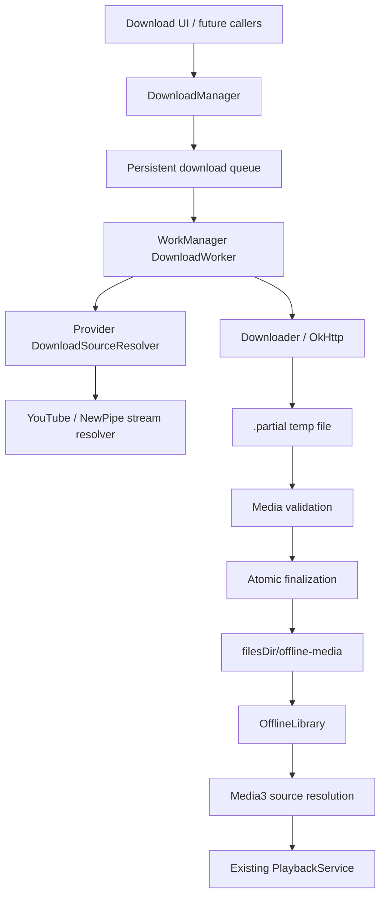

# Phase 3 — Offline Library & Download Manager

## Scope

Phase 3 adds a persistent offline-download subsystem without moving playback authority out of `PlaybackService`. The logical queue and `CatalogTrack.uri` remain the same whether Media3 resolves a track to an online URL or an app-private downloaded file.



## Provider boundary

`MusicBackend` is intentionally unchanged. Download capability is a separate capability because a catalogue backend does not necessarily expose a stable, offline-safe media reference.

- **YouTube Music:** supported through the existing NewPipe stream-resolution path. Stream URLs are resolved at download time and are never persisted because they are short-lived.
- **Spotify/librespot:** explicitly unsupported in Phase 3. The inspected Spotify path exposes playback through the native librespot engine, not a legitimate downloadable media URL. The download layer therefore records `UNAVAILABLE` instead of attempting to capture or persist protected playback data.

Provider-specific quality selection stays inside the resolver. The current YouTube implementation selects the highest available audio stream at or below the requested bitrate when possible.

## Persistent state

State is stored in `filesDir/downloads/state.json` and written using a temporary file followed by an atomic move when supported. Records contain the logical track identity, provider, requested quality, status, progress, byte counters, timestamps, error classification, and collection membership. Raw stream URLs, cookies, access tokens, and authorization headers are not persisted.

The download identity is:

`backend + logical track URI + quality`

This prevents duplicate downloads while allowing a different requested quality to coexist as a distinct artifact.

## State machine

```text
QUEUED -> PREPARING -> DOWNLOADING -> COMPLETED
   |          |              |
   |          |              +--> FAILED (permanent)
   |          +-----------------> QUEUED (bounded transient retry)
   +--> PAUSED -> QUEUED
   +--> CANCELLED -> QUEUED (manual resume/retry)

UNAVAILABLE is used for unsupported provider capability.
```

Partial downloads are never promoted to the final media root. Pause/cancel/restart safely discard partial data because the current downloader deliberately restarts from byte zero instead of pretending to support resumable range downloads.

## Scheduling and concurrency

WorkManager owns persistent execution. Each logical download uses unique work keyed by its stable job id, and constraints are applied at scheduling time. Wi-Fi-only uses `NetworkType.UNMETERED`; otherwise the work requires a connected network. Storage-not-low is also required.

Long-running workers use WorkManager foreground execution with the Android `dataSync` foreground-service type. This matches the platform's guidance for user-visible file downloads. Android's current documentation notes that long-running WorkManager workers can run through a managed foreground service, while Android 15+ applies a six-hour daily timeout to `dataSync` foreground services. The app therefore does not assume a single unbounded download can run forever.

A process-local semaphore limits active downloader execution to two by default. WorkManager can persist more queued jobs, but only the configured number enters the network/file-transfer section at once.

## Storage layout and security

```text
filesDir/
  downloads/
    state.json
    state.json.tmp
  offline-media/
    .partial/
      <job-id>.part
    <sha256(logical-key)>.<validated-extension>
```

Remote filenames are never used. Final names are generated from SHA-256 of the stable logical key. Extensions come from an allowlist derived from the provider/media format or HTTP content type. Stored paths are relative to the managed root and are canonicalized before access or deletion.

The final file is only considered available after:

1. the download stream completed,
2. the byte count is valid when the server supplied a length,
3. MediaMetadataRetriever can parse a positive duration,
4. the file is atomically moved out of `.partial`.

Startup reconciliation revalidates completed records against the actual file. Missing/corrupt files are downgraded to `FAILED` and are not used for offline playback.

The application already has `android:allowBackup="false"`, so local download state and media are not included in Android's normal application backup path.

## Offline playback resolution

The logical media id does not change. For a supported YouTube track, Media3's existing `ResolvingDataSource` first checks the authoritative download records for a valid local file. If one exists, the `DataSpec` is resolved to that app-private file. If the file is missing or fails validation, the resolver falls through to the existing NewPipe online stream resolution.

There is no separate offline queue and no second playback state. Shuffle, repeat, queue position, metadata, and MediaSession identity therefore continue to belong to the existing playback layer.

## Retry and recovery

Retryable HTTP failures are 408, 425, 429, and 5xx. Socket timeouts and other IO failures are transient. Permanent HTTP failures, unsupported providers, malformed responses, invalid media, and unsupported content types do not retry forever. Automatic retries are capped at four attempts with WorkManager exponential backoff.

A temporary network loss does not delete completed offline media. A running worker is stopped by WorkManager when its network constraint becomes false and is eligible to run again when the constraint is restored.

## Wi-Fi-only and quality

`DownloadPreferences` persists both settings. Changing Wi-Fi-only triggers reconciliation/rescheduling. Quality is part of the download identity so changing quality does not overwrite a different completed artifact. Provider resolvers are responsible for mapping quality to the provider's actual available streams; unsupported quality levels are not invented.

## Deletion and playlist membership

A download can belong to multiple collection ids. Removing a playlist removes only that playlist membership. The file is deleted only when no collection membership remains. Individual deletion cancels its work, removes the managed file if present, and removes the persistent record.

## Lifecycle and reboot

WorkManager persists unique work and reconstructs it after process death/device reboot subject to Android scheduling constraints. On application startup, `DownloadManager` reconciles persistent records with the filesystem before requeueing interrupted jobs. The current implementation restarts interrupted partial downloads from zero rather than resuming byte ranges.

## Testing strategy

JVM tests cover retry classification, bounded retry count, controlled extension mapping, and stable download identity. Android/device verification is required for the full matrix of WorkManager execution, foreground notification behavior, network interruption, reboot, storage pressure, and actual YouTube stream downloads.

The repository environment used for this change does not provide an Android emulator/device or a Gradle checkout, so those device-level scenarios must be reported as unverified rather than inferred from compilation.

## Known limitations

- Spotify/librespot offline downloads are intentionally unavailable; the existing native playback path is preserved.
- YouTube stream URLs are provider-generated and can expire; the URL is resolved immediately before each download and is not persisted.
- Pause/resume currently means safe restart from byte zero; HTTP range resume is not claimed.
- Cross-provider download capability is intentionally not added to `MusicBackend`.
- Long-running `dataSync` foreground work is subject to Android platform execution limits.
- Full download/play/delete/re-download/reboot stress testing requires a real Android environment with network access.
