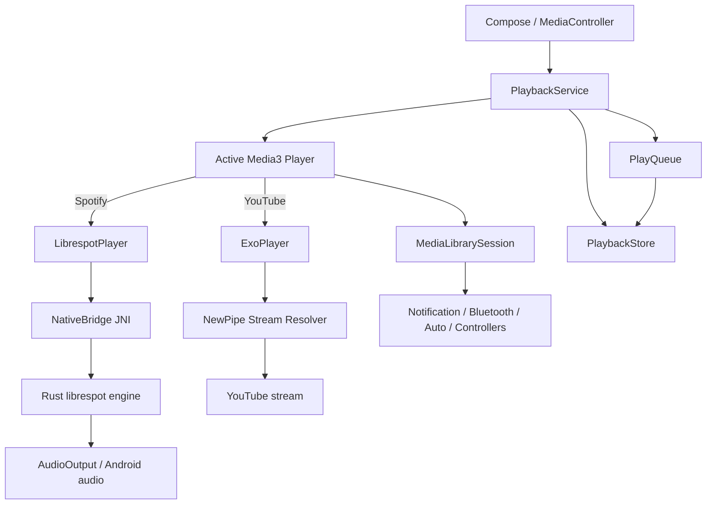

# SPOTLIGHT — Playback Engine 2.0

## Status

Phase 2 is an incremental reliability pass on the existing playback architecture. Spotify/librespot, YouTube/ExoPlayer, MediaSession, `PlaybackService`, JNI, and the vendored Rust core remain in place.

**Validation status:** source-level audit completed; repository-hosted Gradle/Rust execution is not available in the current execution environment, so build/runtime/stress results are explicitly unverified.

## Playback lifecycle



### Ownership

| Concern | Owner |
|---|---|
| Live player | `PlaybackService` |
| Spotify queue | `PlayQueue` / `LibrespotPlayer` |
| Spotify native session | Rust `engine::Engine` |
| YouTube player | `YouTubePlayerFactory` / ExoPlayer |
| MediaSession | `PlaybackService` |
| Persistence | `PlaybackStore` |
| Native exception conversion | `native/src/ffi.rs` |
| Network-quality adaptation | `BandwidthWatch` + native bitrate support |

## State machine

The Spotify adapter uses Media3 player states plus local flags for transient command/reconciliation state.

```text
IDLE
  -> BUFFERING   load/restore/recovery
  -> READY       native `playing`
READY
  -> BUFFERING   new load/skip
  -> READY       pause/resume
  -> IDLE        stop
BUFFERING
  -> READY       playable track starts
  -> IDLE        terminal stop
```

`skipPending`, `skipInFlight`, `ownQueuePending`, `engineQueueStale`, and `awaitingEngine` prevent late native events from being interpreted as a newer queue transition. Native events are marshalled to the player looper before mutating Kotlin state.

## Queue semantics

`PlayQueue` maintains the user-visible order and, when shuffle is active, a saved permutation. `PlaybackStore` persists the logical order and shuffle permutation for Spotify queues. `play-next`, add, remove, and move are mediated by the queue rather than by UI state.

`LibrespotPlayer` updates the native running order without reloading the decoder for queue mutations where the native path supports that operation. A full reload is retained for changes that cannot safely be represented as an in-place native queue update.

## Persistent playback

`SavedPlayback` persists:

- tracks
- current index
- position
- repeat mode
- shuffle permutation
- context information

The persisted snapshot does not contain an autoplay instruction. Restore is paused to avoid unexpected playback after process recreation. Invalid JSON is logged and cleared rather than silently ignored.

The native engine additionally keeps its own pending listening event state for listening-history delivery; this is separate from Android queue restoration.

## Smart preloading / next-track preparation

The existing Rust playback patch preloads the next Spotify track after approximately five seconds of progress rather than immediately at track start. This avoids a burst of key/CDN work during rapid skipping. A failed preload is treated as a failed head-start, not as proof that the track is unavailable.

The current preload implementation is backend-specific: it applies to the Spotify/librespot player. YouTube uses ExoPlayer's normal buffering pipeline.

## Gapless and crossfade

Spotify's vendored `librespot-playback` contains a targeted crossfade patch. It is an overlap/fade implementation inside the native player because the player owns the decoder and sink. The Kotlin adapter does not attempt to mix two independent players.

The implementation therefore has backend-specific limitations:

- Spotify/librespot: native crossfade path exists.
- YouTube: no equivalent crossfade implementation was added in this pass.
- True universal gapless/crossfade behavior cannot be claimed without device/runtime tests.

## Recovery

The current Spotify path has several layers:

1. Native loading retries the same track with bounded delays before emitting `Unavailable`.
2. Failed preloads do not remove tracks from the queue.
3. `SPIRC_LOST` detects a dead Connect task.
4. Kotlin can rebuild the native session without recreating the Android audio output.
5. Generation checks prevent late events from an obsolete native session mutating the new session.
6. Skip commands fall back to a controlled stop when the native Connect path is unavailable because the native player has no independent queue.

The current Kotlin reconnection path performs one native reconnect attempt per detected loss. Repeated retry orchestration is deliberately not claimed as fully verified in this environment.

## JNI / native safety

`native/src/ffi.rs` wraps JNI operations in `catch_unwind` and converts Rust `Result` failures and panics into `IllegalStateException` rather than allowing a native panic to abort the Android process. Native callbacks attach worker threads to the JVM and clear pending Java exceptions after callback failures.

The Kotlin side logs native command failures instead of allowing a failed transport operation to escape through Media3's command stack.

This is a defensive boundary, not proof that every possible Rust UB/native memory fault is impossible. Device/runtime testing is still required for invalid-handle and shutdown races.

## Audio focus / noisy audio

`AudioFocusController` owns the Spotify custom player's Android audio-focus behavior and `AUDIO_BECOMING_NOISY` handling. Transient focus loss pauses and records whether the pause was caused by focus; focus gain resumes only in that case. Ducking preserves the pre-duck volume.

YouTube's ExoPlayer is configured with Media3 audio focus and `setHandleAudioBecomingNoisy(true)`.

## MediaSession / notification / background playback

`PlaybackService` owns the `MediaLibrarySession` and supplies the active player to it. The same player is therefore consumed by notification and controller infrastructure rather than maintaining a parallel UI playback model.

The service remains foreground-capable through Media3's notification lifecycle. Exact Android-version/device behavior remains an instrumentation-test concern.

## Seeking / buffering / errors

Spotify seeking is marshalled through the player looper and guarded against a pending skip. Negative/invalid positions are clamped at the native boundary. Native load failures are converted into controlled errors; malformed Spotify URIs are rejected before reaching the native engine.

YouTube stream resolution happens on ExoPlayer's loading path. An unresolved stream raises a controlled load failure to ExoPlayer rather than being silently converted into a fake playable URL.

## Performance instrumentation

`BandwidthWatch.Measurement` now records immutable evidence for:

- measured track-load latency
- stall count
- selected bitrate
- event sequence
- reason for adaptation

The existing player emits logs for native loading, state transitions, skips, and queue transitions. YouTube's `AnalyticsListener` records playback state, audio underruns, playback-parameter changes, and audio-sink errors.

### Measured results

No device-level latency, CPU, memory, or battery measurements were collected in this execution environment. They are **UNVERIFIED**, not zero and not assumed healthy.

Required future benchmark fields:

| Metric | Baseline | Phase 2 | Status |
|---|---:|---:|---|
| Play request → first playable | — | — | Unmeasured |
| Play request → first audio output | — | — | Unmeasured |
| Skip latency | — | — | Unmeasured |
| Queue transition latency | — | — | Unmeasured |
| Buffering duration | — | — | Unmeasured |
| RSS memory | — | — | Unmeasured |
| CPU | — | — | Unmeasured |
| Battery | — | — | Unmeasured |

## Automated tests

Existing unit coverage includes deterministic `PlayQueue` behavior and playback-state reducer behavior. Phase 2 adds `BandwidthWatchTest` coverage for:

- slow-load measurement and bitrate downgrade
- four-track stability requirement before upgrading quality
- duplicate load notification handling

Full Gradle execution is unavailable in the current environment, so these tests are source-present but **not claimed as passing**.

## Stress-test matrix

| Scenario | Expected protection | Executed here |
|---|---|---|
| Single Spotify track | normal native load | No |
| Spotify playlist | queue + native order | No |
| Long queue | bounded preload / queue snapshot | No |
| Shuffle/repeat | queue/player semantics | No |
| Rapid skips | skip coalescing + stale-event guards | No |
| Rapid seeks | player-looper serialization | No |
| Network loss/recovery | bounded load retry + session rebuild | No |
| Bluetooth/headset disconnect | audio focus/noisy handling | No |
| Background playback | service/session lifecycle | No |
| Process kill | persisted snapshot restore | No |
| Service restart | deterministic reconstruction | No |
| Malformed stream | controlled load failure | No |
| Unavailable track | bounded native retries then unavailable | No |

## Known limitations

1. Runtime/device stress testing is required before declaring production reliability.
2. YouTube and Spotify have materially different buffering and transition semantics; they are not generalized into one fake engine.
3. Universal crossfade is not implemented for YouTube in this pass.
4. First-audio-output timestamping is not currently exposed as a hardware-independent event for Spotify's custom sink.
5. CPU/memory/battery benchmarks require an Android device/emulator and profiling tools.
6. The current Kotlin Spotify reconnect path has a single reconnect attempt per detected loss; repeated bounded retry orchestration remains a future hardening step if runtime evidence shows it is necessary.
7. The native engine uses a process-wide mutex/runtime by design. This is existing infrastructure and was not rewritten.

## Verification limitations

The execution environment does not contain a checkout of the repository and cannot resolve GitHub DNS. Consequently the following commands could not be executed locally:

```text
./gradlew test
./gradlew lint
./gradlew assembleDebug
cargo test
cargo check
```

No passing result is claimed for any of them.

## Implementation order

**P0**

1. Run the complete Gradle unit/lint/debug build on a networked Android build runner.
2. Run native Rust tests/checks and verify JNI symbols against the generated APK.
3. Execute device stress tests for service recreation, process death, rapid skips/seeks, and native shutdown.

**P1**

4. Measure play/skip/transition/buffering latency on representative devices.
5. Validate native reconnect behavior under repeated network loss/recovery.
6. Validate queue persistence and shuffle/repeat restoration after force-stop/service recreation.
7. Validate Bluetooth/headset/audio-focus transitions.

**P2**

8. Expand metrics to first-audio-output, RSS/CPU, and battery measurement paths.
9. Add instrumentation/E2E coverage for YouTube malformed/unavailable streams.
10. Tune preload thresholds only from collected traces.

**P3**

11. Consider broader transition effects only after correctness and measurements justify them.
12. Consider deeper native refactoring only if profiling or crash evidence requires it.

## Inspector conclusion

Source inspection shows substantial Phase 2 reliability infrastructure already present in the baseline: persistent queue state, native bounded load retry, preload, Connect-loss detection, generation-based stale-event protection, audio-focus/noisy handling, native panic conversion, and Media3/ExoPlayer diagnostics.

The Phase 2 increment in this branch adds measurable bandwidth evidence and regression tests without replacing the existing engines.

**Reliability is not declared proven until the unexecuted Gradle/native/device stress matrix above has been run and repeated successfully.**
