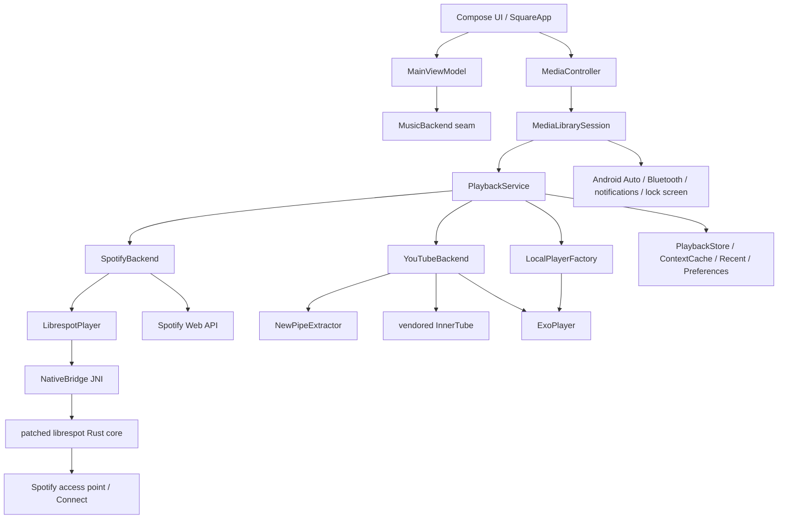
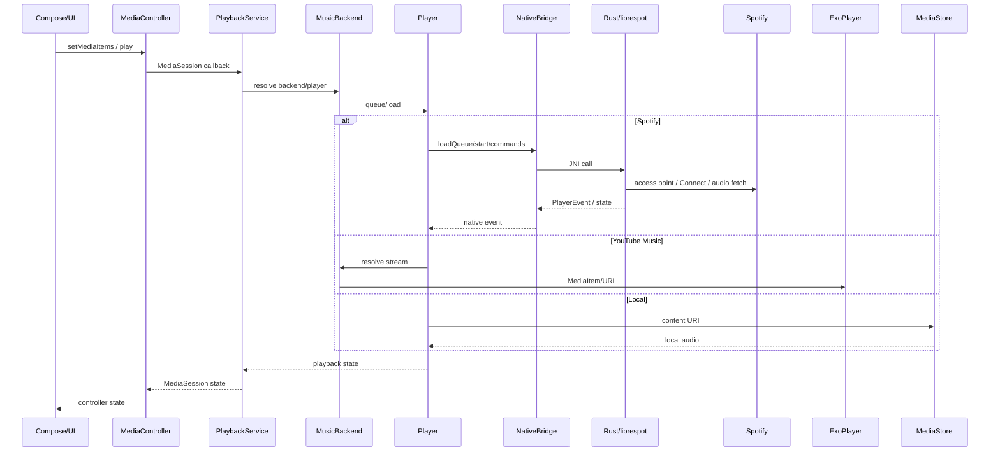
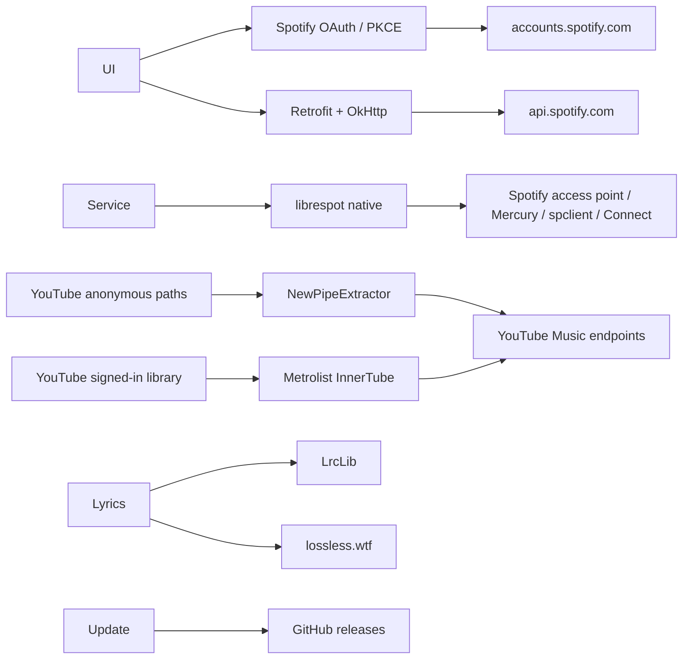

# SPOTLIGHT — Phase 0 Technical Audit

**Repository:** `abdulrehman958280-max/SPOTLIGHT`  
**Audited ref:** `master` at `cb3c213c59746b80fddab16bd5b5dcb5b0a86754` (`2.0.1`)  
**Audit branch:** `audit/phase-0-technical-audit`  
**Audit date:** 2026-08-31  
**Scope:** architecture, playback, networking, storage, security, performance, build health, testing, native/Rust integration, production-readiness, and licensing.  
**Change policy:** audit-only; no Phase 1 implementation and no unrelated refactor.

> **Evidence standard.** Findings below are based on repository source/configuration and repository metadata actually inspected. Runtime/build findings are only called verified where a command or CI result exists. Where the local environment prevented execution, the limitation is recorded explicitly rather than inferred away.

## 1. Executive audit summary

SPOTLIGHT is a production-oriented Android/Kotlin music client with a clear backend seam (`MusicBackend`), a foreground `MediaLibraryService` owning playback, a Compose UI, Spotify playback through a patched native librespot Rust core, and YouTube Music through NewPipeExtractor plus a vendored Metrolist InnerTube module. The architecture is intentionally optimized around a single long-lived playback service and a manual application dependency container.

The strongest areas are:

- playback ownership is correctly separated from the activity/UI;
- Media3 `MediaLibraryService`/`MediaSession` is integrated with Android Auto and media controls;
- Spotify token refresh is serialized and OAuth uses PKCE;
- Spotify/native and YouTube backends are separated behind `MusicBackend`;
- native JNI calls have an explicit exception/panic boundary;
- queue/process-death state is persisted;
- cache entries use Spotify playlist `snapshot_id` where available;
- release builds enable R8/resource shrinking and have explicit JNI keep rules;
- a baseline profile is shipped and profile compilation is observable;
- the repository documents the non-standard Spotify/YouTube protocol and licensing posture instead of pretending the integrations are official.

The most important risks are:

1. **CRITICAL / production-blocking:** the release signing configuration falls back to the standard debug key when `keystore.properties` is absent. `app/build.gradle.kts` explicitly permits this for `release`. A distributable production artifact must not be considered releasable under this configuration.
2. **SECURITY RISK / important:** the native librespot reusable credential is stored under ordinary app-private `filesDir`, not Android Keystore-backed encrypted storage. It is sandboxed, but it is a bearer credential outside the encrypted token store.
3. **BUG / important:** `ContextCacheStore.fileFor()` uses Java `String.hashCode()` as the cache filename. Collisions are possible and can make one context read another context's cached track list.
4. **SECURITY/PRIVACY / important:** `RemoteConnect.known` is process-global, unbounded, and not cleared by `RemoteConnect.clear()`. It can retain playback metadata across session/account transitions and grows with distinct remote tracks.
5. **TECH DEBT / important:** `MainViewModel.kt` is ~118 KB and `SquareApp.kt` is ~130 KB, making UI/state orchestration unusually monolithic and increasing change/test risk.
6. **BUILD/RELEASE risk:** only `arm64-v8a` is configured in `nativeAbis`; x86_64 emulator and armeabi-v7a builds are deliberately excluded.
7. **CI/test gap:** no `.github` directory/workflows were found, no `app/src/test` or `app/src/androidTest` tree was found, and GitHub commit status for `2.0.1` returned an empty status list. There is no repository-backed automated baseline to prevent regressions.
8. **VERIFICATION limitation:** local Gradle/Rust/CMake/test execution could not be performed because the execution environment could not resolve `github.com`; the exact failure is recorded in §34/§42. Therefore build/test health is source-audited but not runtime-verified in this audit.

### Priority summary

| Priority | Finding | Classification | Blocking? |
|---|---|---|---|
| P0 | Release signing can fall back to debug key | CRITICAL BUG, SECURITY RISK | Yes for production distribution |
| P0 | No executable CI/test baseline | MISSING FEATURE, TECH DEBT | Yes before high-risk feature work |
| P0 | Build/runtime baseline unavailable in current environment | Limitation | Yes for audit closure, not a source defect |
| P1 | Native reusable credential not encrypted | SECURITY RISK | Important |
| P1 | Cache filename collision via `hashCode()` | BUG | Important |
| P1 | Remote metadata cache unbounded/not cleared | SECURITY RISK, PERFORMANCE RISK, TECH DEBT | Important |
| P1 | Large UI/ViewModel monoliths | TECH DEBT | Important |
| P1 | Single ABI production coverage | MISSING FEATURE | Important |
| P1 | Release/R8 and native build need device/release verification | PERFORMANCE RISK, TECH DEBT | Important |
| P2 | Error semantics are inconsistent across backends | NEEDS IMPROVEMENT | Improvement |
| P2 | Cache writes are non-atomic and use async `apply()` in several stores | TECH DEBT, PERFORMANCE RISK | Improvement |
| P2 | Dependency/version drift should be continuously checked | TECH DEBT | Improvement |
| P3 | Optional emulator/legacy ABI expansion | MISSING FEATURE | Optional |

## 2. Repository and architecture map

Repository root is a small Gradle Android project with two modules:

```text
SPOTLIGHT/
├── app/                         # Android application
│   ├── build.gradle.kts
│   ├── proguard-rules.pro
│   └── src/main/
│       ├── AndroidManifest.xml
│       ├── baseline-prof.txt
│       ├── cpp/                 # Bungee JNI wrapper
│       └── java/dev/lelonio/square/
│           ├── auth/
│           ├── backend/
│           │   ├── spotify/
│           │   ├── youtube/
│           │   └── lyrics/
│           ├── data/
│           ├── nativecore/
│           ├── playback/
│           ├── ui/
│           └── update/
├── innertube/                   # Vendored/embedded Metrolist-derived client
├── native/                      # Rust cdylib / patched librespot
│   ├── Cargo.toml
│   ├── Cargo.lock
│   ├── src/
│   └── vendor/
├── gradle/libs.versions.toml
├── settings.gradle.kts
├── build.gradle.kts
├── LICENSE
└── README.md
```

High-level runtime architecture:



## 3. Module/package map

### `:app`

- `dev.lelonio.square.ui`: activity, Compose root, screens, navigation, player UI.
- `dev.lelonio.square.playback`: `PlaybackService`, `LibrespotPlayer`, `PlayQueue`, audio focus/output/effects, Android Auto browse tree.
- `dev.lelonio.square.backend`: backend abstraction and Spotify/YouTube implementations.
- `dev.lelonio.square.backend.spotify`: Spotify-specific catalogue/video/Connect/credits paths.
- `dev.lelonio.square.backend.youtube`: YouTube Music account, backend, extraction and video paths.
- `dev.lelonio.square.backend.lyrics`: LRC/TTML/lossless/translation sources.
- `dev.lelonio.square.auth`: Spotify OAuth, Web API account, token storage, engine credentials.
- `dev.lelonio.square.data`: persistence, caches, API gateway, catalogue models, remote Connect state.
- `dev.lelonio.square.nativecore`: single Kotlin JNI surface (`NativeBridge`).
- `dev.lelonio.square.update`: self-update/download/install flow.

### `:innertube`

`com.metrolist.innertube`, an Android library module compiled against API 37 and Java 17 with desugaring. It exposes Ktor/InnerTube functionality to the YouTube Music backend.

### `native`

`squarecore` is a Rust `cdylib`, Rust 2021 edition, patched librespot 0.8.0 components, Tokio runtime, JNI 0.21, and Android-specific logging/context dependencies. `panic = "unwind"`, thin LTO and symbol stripping are enabled for release.

## 4. Android/Kotlin architecture assessment

**Classification: GOOD with NEEDS IMPROVEMENT.**

`SquareApplication` is a manual dependency container and deliberately owns singleton-like stores/backends. This is coherent for a small project and avoids DI framework overhead. `MusicBackend` is a strong seam: the UI does not need to know whether Spotify or YouTube answers a catalogue operation.

Evidence: `app/src/main/java/dev/lelonio/square/SquareApplication.kt`, `backend/MusicBackend.kt`, `PlaybackService.kt`.

The main architectural weakness is scale. `MainViewModel.kt` is approximately 117,847 bytes and `ui/SquareApp.kt` approximately 129,926 bytes at the audited commit. These files centralize many unrelated concerns: catalogue state, remote playback, effects, update state, navigation and presentation composition. This is not proof of a functional defect, but it materially increases regression and test isolation cost.

**Recommendation:** split by bounded state domains only after tests exist. Do not perform this refactor in Phase 0.

## 5. Compose/UI assessment

**Classification: GOOD, PERFORMANCE RISK to verify.**

Compose is enabled in `app/build.gradle.kts`; `SquareApp` uses lifecycle-aware collection (`collectAsStateWithLifecycle`), `rememberSaveable`, `LaunchedEffect`, derived state and isolated playback-position helpers. The code explicitly avoids reading rapidly changing playback position at the top-level composition.

`baseline-prof.txt` and `ProfileReport.kt` show an intentional performance strategy. The source also documents a 128 px backdrop decode and artwork-derived luminance rather than continuous screen capture.

Unverified: actual frame-time/jank metrics, memory allocations, recomposition counts, and device GPU behavior could not be measured in this environment.

## 6. ViewModel/state-management assessment

**Classification: GOOD, TECH DEBT.**

`MainViewModel` is the primary state coordinator and is lifecycle-aware from Compose. The service remains the playback authority, which is the correct ownership boundary.

The issue is size and coupling, not an observed correctness failure. A future decomposition should isolate catalogue/search, library, remote Connect, effects and update state.

## 7. Navigation assessment

**Classification: GOOD.**

`SquareApp.kt` defines explicit routes (`home`, `search`, `library`, `playlist`, `settings`) through `NavHost`/`NavController`. `MainActivity` uses `singleTask` and `onNewIntent` for repeated deep links. Notification open-player requests use a custom action instead of relying on launcher intent delivery.

Important limitation: navigation behavior was source-reviewed only; no UI/instrumentation test was available or executable.

## 8. MediaSession/PlaybackService assessment

**Classification: GOOD.**

`PlaybackService` extends `MediaLibraryService`, builds `MediaLibrarySession`, owns the active `Player`, and keeps Spotify's `LibrespotPlayer` alive independently of the activity. The manifest declares `foregroundServiceType="mediaPlayback"` and both Media3 and legacy Android Auto browser actions.

`MediaBrowseTree` implements `onSetMediaItems`, `onGetChildren`, `onGetSearchResult`, custom shuffle/repeat/radio commands, and queue expansion. This directly addresses the Media3 controller-to-player media-item boundary.

The architecture preserves the requested Spotify/librespot implementation and does not replace it.

## 9. End-to-end playback-flow map



`README.md` and `PlaybackService.kt` both confirm that Spotify audio remains native/librespot while YouTube/local playback uses ExoPlayer.

## 10. Spotify backend assessment

**Classification: GOOD, TECH DEBT / external-fragility risk.**

`SpotifyBackend` separates Web API catalogue operations from native access-point playback. `NativeBridge` exposes rootlist, context tracks, metadata, lyrics, canvas, Connect state and commands. `SpotifyOAuth` uses the librespot/keymaster client id for access-point authentication, while `WebApiAccount` deliberately uses a user-supplied application id for Web API quota isolation.

This is a technically coherent split but relies on private/reverse-engineered Spotify protocols. README explicitly states this and identifies the Terms-of-Service risk. This is a compliance/business risk rather than a source-code bug.

## 11. librespot/Rust/native-core assessment

**Classification: GOOD, NEEDS IMPROVEMENT.**

`native/Cargo.toml` uses patched `librespot-core`, `librespot-playback`, and `librespot-connect` 0.8-compatible sources. `native/vendor/README.md` documents local patches for Mercury POST/header fields, platform identity, language, non-Premium handling, crossfade, retry behavior, bitrate changes, key failures, Connect state, and command responsiveness.

`native/src/engine.rs` owns a process-wide engine mutex and a dedicated multi-thread Tokio runtime. The design intentionally keeps the runtime and audio output alive across reconnects.

Positive native-crash containment: `native/src/ffi.rs` wraps JNI calls with `catch_unwind`, converts errors to `IllegalStateException`, and does not log panic payloads. `Cargo.toml` uses `panic = "unwind"`.

Unverified: actual Rust compilation, Miri/sanitizer runs, native crash rate, thread contention and ABI loading on physical devices.

## 12. JNI boundary/data-flow assessment

**Classification: GOOD with NEEDS IMPROVEMENT.**

Kotlin exposes a single `NativeBridge` surface. Rust exports matching JNI symbols in `native/src/ffi.rs`. String/JSON is used for list-shaped data, reducing Java-array lifetime complexity. Native event callbacks are documented as arriving from worker threads.

`proguard-rules.pro` explicitly keeps `NativeBridge`, `NativeEvents`, `AudioOutput`, and `Stretcher`, which is appropriate for string-resolved JNI entry points.

Risk: the JNI API is very large (`NativeBridge.kt` is ~20 KB) and crosses many semantic domains. It is a high-risk interface for future change. No generated bindings or compile-time signature verification beyond the matching source names exists.

## 13. YouTube Music/InnerTube/NewPipeExtractor assessment

**Classification: GOOD, external-fragility risk.**

`YouTubeBackend` splits anonymous catalogue/stream access from signed-in account library access. Anonymous search uses NewPipeExtractor; signed-in library operations use the vendored Metrolist InnerTube module. `YouTubeAccount` persists the session cookie, visitor data and data-sync id in encrypted preferences.

`gradle/libs.versions.toml` pins NewPipeExtractor to `v0.26.4` and MetrolistExtractor to a commit. `settings.gradle.kts` restricts JitPack repository content to the two intended GitHub group patterns.

Risk: InnerTube and extractor protocols are undocumented and can break without a server-side compatibility guarantee. This is a known operational risk, not a claimed current failure.

## 14. Network-flow map



`ApiFactory` uses HTTPS-only Spotify API base URL, OkHttp timeouts, token injection and a single short 429 retry. Debug logging uses BASIC level, which does not log authorization headers by default.

## 15. OAuth/token/cookie security assessment

**Classification: GOOD for OAuth token store; SECURITY RISK for native credential handling.**

`TokenStore` uses `EncryptedSharedPreferences` with an AES-256-GCM `MasterKey`, AES-SIV key encryption and AES-GCM values. Refresh is serialized through a process-wide `Mutex` keyed by token file. Successful token saves use `commit()`, which is appropriate for refresh-token rotation durability.

`SpotifyOAuth` implements PKCE with a cryptographically random verifier and state, validates the returned state, and binds the redirect listener to `127.0.0.1`.

`YouTubeAccount` also uses `EncryptedSharedPreferences`; the stored cookie is nevertheless effectively a bearer session credential and deserves the same threat model as a password/token.

**Security risk:** `EngineCredentials` points to `filesDir/librespot/reusable/credentials.json` and the native engine uses it as reusable authentication state. It is protected by Android's application sandbox but is not encrypted at rest with Keystore-backed storage. Rooted-device extraction, backup/forensic access, or an app-private file exposure would be more damaging than ordinary preferences.

**Recommendation:** P1. Evaluate whether librespot's credential format can be wrapped/encrypted without breaking native access. Do not blindly move it to a different format without testing engine startup/recovery.

## 16. Lyrics assessment

**Classification: GOOD.**

The repository contains `Amll.kt`, `Lossless.kt`, `LrcLib.kt`, `TrackTitle.kt`, `Translate.kt`, and `Ttml.kt`. README documents lossless.wtf first, then LrcLib, plus Spotify lyrics and TTML word timing. The source distinguishes timed words from line-timed lyrics instead of manufacturing word timing where none exists.

Unverified: service availability, copyright/licensing terms of lyric sources, and end-to-end lyric rendering on a device.

## 17. Canvas/video assessment

**Classification: GOOD, NEEDS IMPROVEMENT.**

Spotify video requests in `PlaybackService.playVideoRequest()` obtain a native access token, write a temporary DASH manifest under `cacheDir`, and construct a Widevine DRM `MediaItem`. `MainActivity` supports PiP for both YouTube and Spotify video modes.

Risk: temporary manifest/cache lifecycle and DRM/network behavior were source-reviewed but not measured on device. A future audit should verify cache cleanup, DRM failure UX and PiP transitions under process pressure.

## 18. DSP/audio-effects assessment

**Classification: GOOD, PERFORMANCE RISK to verify.**

Speed/pitch uses Bungee through `stretch.cpp`; the JNI layer converts interleaved int16 PCM to planar float and back, clamps output, and validates direct buffers. `AudioOutput` uses a dedicated fade executor and controls reverb through `EnvironmentalReverb`, preferring a track session where possible.

The DSP path is CPU/memory intensive and sits directly on playback timing. `AudioOutput.kt` explicitly notes buffer copies and a phase-vocoder path. The implementation is technically deliberate, but no CPU/battery/underrun measurements were possible.

## 19. Downloads/storage/local-persistence assessment

**Classification: GOOD, NEEDS IMPROVEMENT.**

Local music discovery uses MediaStore and `READ_MEDIA_AUDIO`/legacy storage permissions only. The app does not assume a downloader folder. Playback state uses `PlaybackStore`; playlist/context caches use files in `cacheDir`; preferences store UI/settings state.

`PlaybackStore` caps non-shuffled saved queues at 200 tracks. Context cache is capped at 40 entries and seven days.

Risk: several stores use `SharedPreferences.apply()` or direct file `writeText()`, so latest state is not guaranteed to be durable at the instant of process death. `ContextCacheStore` handles malformed partial files, but the write itself is not atomic.

## 20. Android Auto/background/notification/media-control assessment

**Classification: GOOD.**

Manifest declares media playback foreground service, POST_NOTIFICATIONS, and Android Auto metadata. `MediaBrowseTree` explicitly supports root/playlists/recent/search and expands a single tapped track back into its parent queue. `MainActivity` uses an activity-scoped MediaController and releases it in `onStop`.

`AudioFocusController` handles gain/loss, transient loss, ducking and `ACTION_AUDIO_BECOMING_NOISY` with a non-exported receiver.

Bluetooth/lock-screen behavior is inherited through Media3 session state. This was source-reviewed, not physically exercised.

## 21. Lifecycle/process-death/recovery assessment

**Classification: GOOD, NEEDS IMPROVEMENT.**

`PlaybackService` owns the player independently from the activity and calls native shutdown in service teardown. `PlaybackStore` persists queue/position; service restores queue on startup. The app intentionally does not persist a “was playing” bit, avoiding surprise playback on launch.

`MainActivity` releases the MediaController in `onStop`. The native engine is designed to survive Connect reconnection without tearing down the Tokio runtime or Android audio output.

Limitation: no automated process-death/instrumentation test exists, so correctness under OS kill, service recreation, storage pressure and reboot is not verified.

## 22. Cache/database assessment

**Classification: NEEDS IMPROVEMENT.**

There is no Room/SQLite database. Persistence is primarily SharedPreferences plus JSON files. This is adequate for the current data shape but makes atomic multi-record updates, migrations and indexed queries harder.

**Verified bug:** `ContextCacheStore.fileFor(uri)` names cache files using `uri.hashCode()`. Java hash collisions are legal and deterministic. Two distinct context URIs can therefore map to the same file. The cache also does not independently verify that the file's `Entry.uri` matches the requested URI after reading; it trusts the filename mapping. This can return a wrong playlist/album cache on a collision.

**Remediation:** P1; use a collision-resistant filename (e.g. SHA-256) and validate `entry.uri == requestedUri` before use.

## 23. Coroutines/concurrency assessment

**Classification: GOOD, NEEDS IMPROVEMENT.**

The project uses structured coroutines in Compose and backend calls. YouTube search uses `coroutineScope` + four `async` calls in parallel. Token refresh is mutex-protected. Native playback has a dedicated Tokio runtime.

The main concerns are deliberate blocking bridges: `ApiFactory.AuthInterceptor` uses `runBlocking` because OkHttp interceptors are synchronous, and `RateLimitInterceptor` uses `Thread.sleep()` for a bounded 429 wait. These are acceptable in OkHttp dispatcher threads but should be watched for dispatcher starvation under request bursts.

`RemoteConnect.known` is an unbounded mutable map. This is a concrete memory-management/concurrency concern because cluster events can introduce arbitrary track URIs over a long-lived process.

## 24. Error-handling assessment

**Classification: NEEDS IMPROVEMENT.**

Positive: JNI converts native failures into Java exceptions; many UI-facing operations use `runCatching`; token expiry has a dedicated exception; updater has explicit `Failed` state.

Negative: error semantics differ across subsystems. `YouTubeBackend.searchItems()` converts any failure to an empty list, making network/service failure indistinguishable from a valid zero-result search. `MediaBrowseTree` similarly returns empty lists after failures because Android Auto has limited error surfaces. This can hide operational outages.

**Recommendation:** P2. Introduce typed backend errors or result states at the seam without changing the public UX in Phase 0.

## 25. Memory-management assessment

**Classification: NEEDS IMPROVEMENT, PERFORMANCE RISK.**

The native engine deliberately owns long-lived state. `init_android_context()` pins a global Android `Context` and intentionally leaks the global reference for process lifetime. This is bounded by one reference and is consistent with the native context API's lifetime requirements.

`AudioOutput` owns a single fade executor thread. It is daemonized, but there is no explicit executor shutdown in the shown lifecycle. The service should remain long-lived for playback, so this is low immediate risk, but explicit lifecycle ownership would be cleaner.

`RemoteConnect.known` is the more concrete issue: it is never bounded and `clear()` does not clear it. P1 remediation should bound/clear it on session changes.

## 26. Performance assessment

**Classification: GOOD design intent; PERFORMANCE RISK unverified.**

The repository contains explicit performance work: baseline profile, 128 px backdrop decode, lifecycle-aware state collection, cached playlist resolution, prefetch/read-ahead tuning in Rust, asynchronous effect updates, and avoiding top-level position recomposition.

The Rust engine comments cite historical measurements and tuning, including a median ~1.9 s track start and p90 ~4.6 s in a previous measured scenario. Those numbers are historical source comments, **not measurements performed in this audit**, and must not be treated as the current baseline.

## 27. Startup/scrolling/playback-latency assessment where measurable

**Classification: UNVERIFIED / PERFORMANCE RISK.**

No current measurement was possible. Required future instrumentation:

- cold/warm startup time to first Compose frame;
- time to MediaController connected;
- time from play command to first audible PCM;
- p50/p90/p99 playback start;
- skip-to-audio latency;
- Compose frame time and jank during library scrolling;
- memory/PSS after 30/60 minutes playback;
- audio underrun count;
- battery drain during native DSP vs no DSP;
- PiP/video decoder startup.

The repository's own historical measurements must be rerun against the current `2.0.1` artifact.

## 28. Native-crash assessment

**Classification: GOOD containment, UNVERIFIED runtime rate.**

`native/src/ffi.rs` wraps JNI entry points in `catch_unwind`. `panic = "unwind"` is configured. Panic payloads are not logged, reducing accidental leakage of listening data. The native engine also avoids dropping the long-lived Tokio runtime during reconnect.

However, `catch_unwind` does not guarantee memory safety against UB, double-free, allocator corruption, or aborting dependencies. Native crash testing is therefore still required.

Recommended P1 verification: physical-device stress tests with repeated start/stop/reconnect/seek/effects/queue mutations, plus native crash capture and tombstone inspection.

## 29. Security/privacy/permissions assessment

**Classification: NEEDS IMPROVEMENT.**

Good:

- HTTPS is used for OAuth/token/Web API/update URLs.
- OAuth uses PKCE and state validation.
- Spotify tokens and YouTube cookies use encrypted preferences.
- media permission is scoped to audio on modern Android.
- exported services/receivers are constrained where possible.
- Android backup is explicitly disabled in the manifest.
- debug HTTP logging is BASIC and does not intentionally log bearer headers.

Risks:

- native reusable Spotify credential is not encrypted;
- `REQUEST_INSTALL_PACKAGES` materially increases distribution/security sensitivity and should remain justified by the self-updater;
- YouTube session cookies represent sensitive account access;
- remote metadata is retained in an unbounded process map and not cleared on logout;
- reverse-engineered private protocols create supply-chain and service-policy risk.

## 30. ProGuard/R8 assessment

**Classification: GOOD, NEEDS RELEASE VERIFICATION.**

Release has `isMinifyEnabled = true`, `isShrinkResources = true`, and the optimized default ProGuard configuration plus `proguard-rules.pro`. JNI methods/classes, serialization companions, Retrofit signatures and Rhino/NewPipe classes are explicitly handled.

The most important verification is a real `assembleRelease` followed by installing/running the minified artifact and exercising JNI, NewPipe extraction, Retrofit serialization and InnerTube. No such build could run in this environment.

## 31. Gradle/build/dependency assessment

**Classification: NEEDS IMPROVEMENT.**

Observed versions include:

- AGP 8.13.2
- Kotlin 2.3.21
- Compose BOM 2026.06.01
- Media3 1.5.1
- Coroutines 1.9.0
- Lifecycle 2.8.7
- OkHttp 4.12.0
- Retrofit 2.11.0
- Kotlin serialization 1.7.3
- Ktor 3.5.2
- NewPipeExtractor `v0.26.4`
- MetrolistExtractor `3cd3341`
- Gradle wrapper 9.3.0

`settings.gradle.kts` uses `FAIL_ON_PROJECT_REPOS` and restricts JitPack content. This is good supply-chain hygiene.

Build complexity is significant because Gradle invokes Cargo via `cargo-ndk`, clones Bungee during the build if absent, and uses external CMake. A clean build therefore has more environmental prerequisites than a conventional Android project.

## 32. Rust dependency/ABI assessment

**Classification: NEEDS IMPROVEMENT / PRODUCTION RISK.**

`native/Cargo.toml` declares `rust-version = "1.81"`, while the README states Rust >=1.86 and the app build script contains comments describing dependency/toolchain failures requiring newer Rust. This is an inconsistency in the declared toolchain contract and should be reconciled before production CI is introduced.

`native/Cargo.lock` is committed and contains checksums, which is good reproducibility practice.

Only `arm64-v8a` is enabled by default in `app/build.gradle.kts`; x86_64 and armeabi-v7a mappings exist in the script but are not active. This is a deliberate optimization but means emulator/legacy-ABI coverage is absent.

## 33. CI/CD assessment

**Classification: MISSING FEATURE.**

No `.github` directory/workflows were found via repository contents inspection. The latest `2.0.1` commit has an empty GitHub commit-status list. Branch protection for the created audit branch is disabled, and no required checks are configured.

There is no verified automated pipeline for:

- Gradle debug/dev/release builds;
- lint/static analysis;
- R8 release smoke test;
- Rust `cargo check/test/clippy`;
- dependency audit;
- APK artifact generation;
- ABI coverage;
- license checks.

**Priority:** P0 before substantial Phase 1 feature development.

## 34. Test infrastructure and baseline-test assessment

**Classification: MISSING FEATURE / TECH DEBT.**

Repository tree inspection shows `app/src/main` but no `app/src/test` or `app/src/androidTest` directory. A repository search for `#[test]` returned no results. No GitHub Actions status was present.

### Baseline command record

| Command/action | Result | Evidence |
|---|---|---|
| `git clone https://github.com/abdulrehman958280-max/SPOTLIGHT.git /tmp/SPOTLIGHT` | **FAILED** | `fatal: unable to access 'https://github.com/abdulrehman958280-max/SPOTLIGHT.git/': Could not resolve host: github.com` |
| `./gradlew :app:assembleDebug` | **NOT RUN** | Repository could not be cloned into the execution environment because DNS/network access to GitHub failed |
| `./gradlew lint` | **NOT RUN** | Same blocker |
| `./gradlew :app:assembleRelease` | **NOT RUN** | Same blocker |
| `./gradlew :app:assembleDev` | **NOT RUN** | Same blocker |
| `cargo check --locked` | **NOT RUN** | Local repository unavailable due clone blocker |
| `cargo test --locked` | **NOT RUN** | Local repository unavailable due clone blocker |
| `cargo clippy --locked --all-targets` | **NOT RUN** | Local repository unavailable due clone blocker |
| Android instrumentation tests | **NOT RUN** | No `app/src/androidTest` tree found and no device/emulator available |
| Unit tests | **NOT RUN** | No `app/src/test` tree found |
| GitHub commit statuses for `cb3c213c...` | **EMPTY** | GitHub status API returned `statuses: []` |

These are limitations, not claims that the project fails to build.

## 35. Documentation assessment

**Classification: GOOD.**

`README.md` is unusually detailed for a music client. It documents architecture, Spotify/YouTube protocol boundaries, native requirements, release signing, patched librespot behavior, OAuth redirect requirements, MediaSession callback behavior, caching, performance history, third-party licenses, and known legal/service constraints.

The audit found one documentation inconsistency worth fixing later: README says Rust >=1.86 while `native/Cargo.toml` says rust-version 1.81. Build comments also mention a dependency requiring newer Rust. This should be made one source of truth.

## 36. Licensing/compliance assessment

**Classification: NEEDS IMPROVEMENT / COMPLIANCE RISK.**

The repository is GPL-3.0-or-later (`LICENSE`). README identifies major third-party licenses: librespot MIT, Metrolist/NewPipe GPL-3.0, Bungee MPL-2.0, AndroidLiquidGlass Apache-2.0, Phosphor MIT, and others.

`native/vendor/README.md` states that modified librespot sources retain their MIT license and describes local patches. Bungee is fetched at build time rather than vendored.

Risks to resolve before external distribution:

- ensure corresponding source/attribution for vendored GPL/MIT/MPL/Apache components is included in distributed source/artifacts as required by each license;
- ensure the Bungee source fetched at build time is reproducibly available to downstream builders;
- ensure UI legal notices satisfy GPL interactive-user-interface requirements where applicable;
- separately review Spotify/YouTube contractual/service terms, which are not resolved by open-source licensing.

This is not a legal opinion; it is a repository compliance gap requiring a formal release checklist.

## 37. Technical-debt inventory

1. `MainViewModel.kt` (~118 KB) is too large for safe independent change/testing.
2. `SquareApp.kt` (~130 KB) is too large and mixes navigation, global state wiring and UI behavior.
3. `NativeBridge.kt` is a broad semantic boundary rather than a few cohesive native interfaces.
4. No CI/test baseline exists.
5. No automated dependency/license/security audit exists.
6. Toolchain contract is inconsistent (`rust-version` vs README/build comments).
7. Cache persistence is JSON-file/SharedPreferences based with limited migration/atomicity semantics.
8. Error states are sometimes collapsed into empty results.
9. Default native ABI coverage is intentionally narrow.
10. Performance claims are not continuously regression-tested.
11. Native credential storage is not encrypted.
12. Remote metadata cache is unbounded and not cleared on logout/session reset.

## 38. Missing-infrastructure/missing-feature inventory

- CI pipeline for Gradle/Rust/CMake.
- Unit-test source set.
- Instrumentation/UI-test source set.
- Native stress/crash harness.
- Release artifact smoke-test job.
- ABI matrix build job.
- Dependency vulnerability/license scanning.
- Performance regression benchmark job/device test.
- Formal privacy/data-retention documentation.
- Formal third-party attribution/source bundle verification.
- Automated process-death/playback recovery tests.
- Automated R8/JNI/NewPipe/InnerTube compatibility smoke tests.

These are infrastructure gaps, not Phase 1 feature requests.

## 39. Upgrade risks and dependencies between future changes

| Change | Dependency / risk |
|---|---|
| librespot upgrade | Re-apply and revalidate all `native/vendor` patches; JNI/event/queue behavior can change |
| NewPipe upgrade | YouTube extraction compatibility and R8/Rhino rules must be retested |
| Metrolist/InnerTube upgrade | Session cookie, visitor/data-sync fields and API models can change |
| Media3 upgrade | MediaSession callback semantics, Auto behavior and controller compatibility require regression tests |
| Kotlin/AGP/Gradle upgrade | Compose compiler, R8, native build and configuration-cache behavior need full build verification |
| Rust upgrade | `Cargo.lock`, patched crates and Android target compatibility must be rebuilt for every ABI |
| Bungee upgrade | CMake/JNI ABI, audio quality, CPU use and license/source reproducibility need verification |
| Token storage changes | Playback continuity and refresh-token rotation must be tested with process death |
| Cache format changes | Migration must preserve saved queue and playlist membership state |
| PlaybackService changes | Must be tested with UI absent, Auto bound, Bluetooth controls and process recreation |

## 40. Prioritized roadmap

### P0 — must fix before feature work

1. **Production signing gate:** remove the release-to-debug-key fallback. Release must fail configuration/build when production signing material is absent.
2. **Establish CI:** Gradle dev/debug/release, lint, Rust locked checks, and artifact smoke tests.
3. **Create minimum test baseline:** token refresh, queue serialization, cache collision/identity, version comparison, backend error mapping, JNI contract smoke test.
4. **Run the complete build/test baseline in a network-enabled Android/Rust environment and record outputs.**
5. **Add release artifact verification:** install minified APK, exercise JNI, NewPipe, InnerTube, OAuth, playback, Auto, notifications and update flow.

### P1 — important

1. Encrypt or otherwise harden native reusable Spotify credentials without breaking librespot.
2. Replace `ContextCacheStore` `hashCode()` filenames with collision-resistant IDs and validate stored URI identity.
3. Bound/clear `RemoteConnect.known` and define session/account lifecycle for remote metadata.
4. Add process-death and playback-recovery instrumentation tests.
5. Add native playback stress/crash tests and physical-device audio underrun monitoring.
6. Reconcile Rust toolchain declarations and pin the CI toolchain.
7. Decide whether x86_64 emulator builds belong in CI even if release stays arm64-only.
8. Verify release R8/JNI/NewPipe/serialization behavior continuously.

### P2 — improvement

1. Decompose `MainViewModel` into domain state holders.
2. Decompose `SquareApp` into route-level orchestration and screen modules.
3. Standardize typed backend error states instead of treating all search failures as empty results.
4. Make JSON cache writes atomic and review `apply()` vs `commit()` based on recovery requirements.
5. Add dependency/license/security scanning.
6. Add performance benchmark dashboards and startup/playback latency regression thresholds.

### P3 — optional

1. Enable additional ABIs for emulator/legacy hardware if product requirements justify the build cost.
2. Further simplify manual dependency wiring only if testability requires it.
3. Expand optional diagnostics/telemetry tooling only with an explicit privacy review.

## 41. Recommended implementation order

```text
1. Establish reproducible toolchain + CI
        ↓
2. Add minimum unit/integration/native smoke tests
        ↓
3. Fix release signing gate
        ↓
4. Fix cache identity + remote metadata lifecycle
        ↓
5. Harden native credential storage
        ↓
6. Verify R8/JNI + release artifact on physical device
        ↓
7. Verify playback/process-death/Auto/Bluetooth recovery
        ↓
8. Establish measured startup/playback/DSP performance baseline
        ↓
9. Only then decompose MainViewModel/SquareApp incrementally
        ↓
10. Phase 1 feature work
```

The order is dependency-driven: testing and CI must exist before large refactors; release signing and artifact verification must precede production distribution; playback/native correctness must be measured before changing the core architecture; only after those controls exist is UI/state decomposition low-risk.

## 42. Audit limitations and unverified areas

### Verified by repository inspection

- repository structure, modules and package map;
- Git state metadata and current `master` commit;
- dedicated audit branch creation;
- Android manifest and permissions;
- Gradle/build configuration and versions;
- Compose/ViewModel/navigation source;
- MediaSession/PlaybackService/Android Auto source;
- Spotify Web API/OAuth/native access-point source;
- YouTube Music/NewPipe/InnerTube source/configuration;
- token/cookie storage;
- cache/local persistence;
- JNI/Rust/C++ boundary;
- R8/ProGuard rules;
- update service/self-updater;
- README/license/vendor documentation;
- CI directory absence and commit-status absence;
- test source-tree absence.

### Unverified because of environment/tooling limitations

- Gradle compilation/build success or failure;
- dependency resolution against current remote repositories;
- Android lint/static analysis output;
- R8/minified release behavior;
- Rust compilation/test/clippy output;
- CMake/Bungee compilation;
- native ABI loading on a device/emulator;
- runtime playback, audio underruns, native crashes;
- startup/scrolling/playback-latency measurements;
- battery/thermal behavior;
- Android Auto/Bluetooth/notification physical behavior;
- process-death/reboot recovery;
- current third-party service availability;
- current dependency CVE status from an external advisory database;
- formal legal/licensing interpretation.

### Exact execution blocker

```text
git clone https://github.com/abdulrehman958280-max/SPOTLIGHT.git /tmp/SPOTLIGHT

fatal: unable to access 'https://github.com/abdulrehman958280-max/SPOTLIGHT.git/':
Could not resolve host: github.com
```

Affected areas: build health, tests, lint/static analysis, Rust/CMake verification, release artifact verification, runtime performance, native crash validation. The source/configuration audit was completed despite this blocker.

**Blocker priority:** P0 for closing the verification portion of the audit, not a claim that the repository itself is broken.

**Safest next action:** run the recorded Gradle/Rust/CMake command set from §34 in a network-enabled Android build environment using the exact audited commit, then append the actual outputs to this document.

## 43. 47-area coverage matrix

The original scope contains 47 audit areas when the requested compound topics are decomposed into individually verifiable areas. Each is explicitly covered below.

| # | Area | Status | Evidence / limitation |
|---:|---|---|---|
| 1 | Android architecture | Verified | `SquareApplication`, `MainActivity`, service/backend seam |
| 2 | Kotlin architecture | Verified | Kotlin module/package structure; manual DI |
| 3 | Jetpack Compose | Verified | `SquareApp`, Compose build features |
| 4 | ViewModels/state | Verified | `MainViewModel`, lifecycle-aware collection |
| 5 | Navigation | Verified | `NavHost`/routes in `SquareApp` |
| 6 | MediaSession | Verified | `PlaybackService`, `MediaLibrarySession` |
| 7 | PlaybackService | Verified | foreground service and player ownership |
| 8 | End-to-end playback | Verified by source | Spotify/YouTube/local paths mapped |
| 9 | Spotify backend | Verified | `SpotifyBackend`, `NativeBridge` |
| 10 | librespot | Verified | patched vendor 0.8.0 + Rust engine |
| 11 | Rust/native core | Verified by source | `native/src/*`, Cargo config |
| 12 | JNI boundary | Verified | `NativeBridge.kt`, `ffi.rs`, ProGuard |
| 13 | YouTube Music backend | Verified | `YouTubeBackend` |
| 14 | InnerTube | Verified | `:innertube`, `YouTubeAccount` |
| 15 | NewPipeExtractor | Verified | pinned dependency/configuration |
| 16 | Networking | Verified | OkHttp/Retrofit/Ktor/native flows |
| 17 | OAuth | Verified | PKCE + state + loopback |
| 18 | Token storage | Verified | encrypted preferences; native credential risk |
| 19 | Cookie storage | Verified | encrypted YouTube cookie storage |
| 20 | Lyrics | Verified | TTML/LRC/Lossless/LrcLib modules |
| 21 | Canvas/video | Verified by source | DASH/Widevine/PiP paths |
| 22 | DSP/audio effects | Verified by source | Bungee/reverb/audio output |
| 23 | Downloads | Verified by source | updater/download handoff |
| 24 | Storage/local files | Verified | MediaStore/local player |
| 25 | Android Auto | Verified by source | `MediaBrowseTree`, manifest |
| 26 | Background execution | Verified by source | media/update foreground services |
| 27 | Notifications | Verified by source | Media3 provider + update notification |
| 28 | Bluetooth/media controls | Source-covered | MediaSession/audio-focus integration; no device test |
| 29 | Process-death recovery | Source-covered | `PlaybackStore`; no runtime test |
| 30 | Lifecycle recovery | Source-covered | activity/service ownership; no runtime test |
| 31 | Caching | Verified | context/playback caches |
| 32 | Database/local persistence | Verified | no DB; SharedPreferences/JSON files |
| 33 | Coroutines | Verified | structured backend/UI/native coordination |
| 34 | Concurrency | Verified by source | token mutex, native runtime, remote map concern |
| 35 | Error handling | Verified | explicit JNI/update errors; inconsistent backend semantics |
| 36 | Memory management | Source-reviewed | concrete unbounded `RemoteConnect.known`; runtime measurement unavailable |
| 37 | Performance | Source-reviewed | baseline profile/prefetch/DSP design; no current measurements |
| 38 | Startup | Unverified | no executable environment |
| 39 | Scrolling | Unverified | no device/frame metrics |
| 40 | Playback latency | Unverified current baseline | historical comments exist, no fresh measurement |
| 41 | Native crashes | Source-reviewed | `catch_unwind`; no device/tombstone test |
| 42 | Security/privacy | Verified by source | token/cookie/permission/export review |
| 43 | ProGuard/R8 | Source-reviewed | release config + keep rules; minified build unverified |
| 44 | Gradle/build/dependencies | Source-reviewed | versions/config; build not executable |
| 45 | Rust dependency/ABI | Source-reviewed | lockfile, patched crates, arm64 default; compile unverified |
| 46 | CI/CD + tests | Verified absence | no workflows/test source; commit statuses empty |
| 47 | Documentation + licensing | Verified | README/LICENSE/vendor notices; formal legal review remains external |

## 44. Independent inspector pass

The audit was rechecked against the requested inspector questions:

- **Claims backed by evidence:** findings cite concrete paths/symbols and repository configuration; runtime claims are explicitly separated from source claims.
- **Exact locations:** critical/important findings identify `app/build.gradle.kts`, `ContextCacheStore.kt`, `RemoteConnect.kt`, `EngineCredentials.kt`, `MainViewModel.kt`, `SquareApp.kt`, and native/JNI files.
- **Spotify/librespot and YouTube systems:** both were directly inspected; no backend was assumed from README alone.
- **JNI/native/ABI:** `NativeBridge.kt`, `ffi.rs`, `engine.rs`, `sink`-related audio output, `Cargo.toml`, `Cargo.lock`, vendor patch documentation, CMake and ABI configuration were inspected.
- **OAuth/tokens/cookies/permissions/network/privacy:** `SpotifyOAuth.kt`, `TokenStore.kt`, `WebApiAccount.kt`, `YouTubeAccount.kt`, `AndroidManifest.xml`, `ApiFactory.kt` and update code were inspected.
- **Background/media/Auto:** `PlaybackService`, `AudioFocusController`, `MediaBrowseTree`, manifest and `MainActivity` were inspected.
- **Compose/state/navigation/cache/coroutines:** source and package structure were inspected; no test execution was falsely implied.
- **Build/dependency/R8/CI/tests/licensing:** Gradle/version catalog/wrapper, ProGuard, `.github` absence, test tree absence, README/LICENSE/vendor documentation were inspected.
- **Failures:** the local clone failure is reported verbatim; no build/test failure was invented.
- **Performance:** historical source comments are not presented as fresh measurements.
- **Priorities:** each major verified risk is mapped to P0/P1/P2/P3.
- **Phase 1 scope:** no Phase 1 feature or unrelated refactor was implemented; only this audit document was added on the dedicated branch.

## 45. Final audit disposition

**Disposition: CONDITIONAL PASS — source audit complete; runtime/build verification blocked.**

The repository has a coherent production-oriented architecture and substantial prior engineering work around playback, native recovery, caching, and performance. It is **not yet possible to certify build health, release artifact health, runtime playback stability, or performance baseline from this environment** because the required local clone failed on DNS/network access and the repository has no CI results to substitute.

The two source-level production blockers are the release signing fallback and the absence of an automated verification baseline. The cache identity collision, native credential storage, remote metadata retention, and large state/UI monoliths are important but should be addressed in the stated order after the test/build baseline exists.

No Phase 1 feature work should begin until the P0 verification loop in §41 has been completed.
